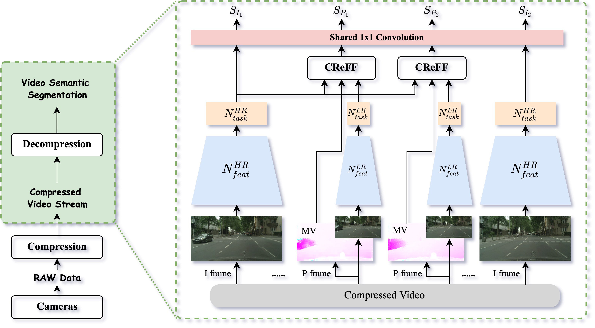
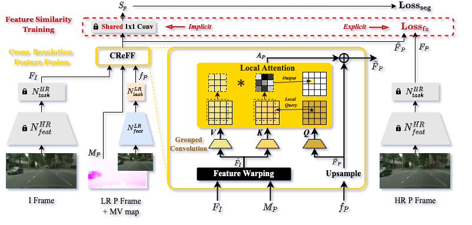

# AR-Seg

> Efficient Semantic Segmentation by Altering Resolutions for Compressed Videos <br>
[Yubin Hu](https://github.com/AlbertHuyb), [Yuze He](https://github.com/hyz317/), Yanghao Li, Jisheng Li, Yuxing Han, Jiangtao Wen, Yong-Jin Liu <br>
CVPR 2023

## Introduction 

AR-Seg is an efficient video semantic segmentation framework for compressed videos. It consists of an HR branch for keyframes and an LR branch for non-keyframes.


We design a Cross Resolution Feature Fusion (CReFF) module and a Feature Similarity Training (FST) strategy to compensate for the performance drop because of low-resolution. 


## Dataset & Pre-processing

Please refer to the [documentation](./pre-process/README.md).

## Evaluation

We provide the sample code, checkpoints and processed data for evaluting AR-Seg on CamVid and Cityscapes datasets. 

### Checkpoints

Please download the checkpoints from [TsinghuaCloud](https://cloud.tsinghua.edu.cn/f/bb4bedf8c7af4ec8a5b2/) / [GoogleDrive](https://drive.google.com/file/d/1u3CUNoRRDi1V1Y4b5Hv8gFwYGdKjXJtp/view?usp=share_link). And then unzip the files into directory `./checkpoints/`. After unzipping, the directory structure should look like `./checkpoints/camvid-bise18/HR/`.

We release the checkpoints trained on CamVid for different LR branch resolutions, ranging from 0.3x to 0.9x. As for Cityscapes, we release the checkpoints trained for 0.5x LR resolution.

### Processed Data

You can pre-process the CamVid and Cityscapes dataset following the instructions in [documentation](./pre-process/README.md), and then place the processed data under `./data/`.

Or you can download our example processed data of CamVid from [TsinghuaCloud](https://cloud.tsinghua.edu.cn/d/f358201e9ac14c4e801a/) / [GoogleDrive](https://drive.google.com/drive/folders/1EMDyP59-WE2OK8FqYFY_f3SAd7PgZ7Ld?usp=share_link). And then unzip the files into directory `./data/`. After unzipping, the directory structure should look like `./data/camvid-sequence/3M-GOP12`.

### Run the Evaluation Script

You can run the evaluation script with different backbones on different datasets.
```
python evaluation.py --dataset [camvid(default) or cityscapes] --backbone [psp18(default) or bise18] --mode [1 1 1(default) or 0 0 1 or etc.]
``` 
For example, if you want to evaluate the HR branch performance with BiseNet-18 on CamVid, you can run the script below.
```
python evaluation.py --dataset camvid --backbone bise18 --mode 1 0 0 
```

### Check the Evaluation Results

The evaluation results will be stored under `./evaluation-result`. Each file contains $L$ $mIoU_d$ values for each reference distance, ranging from 0 to $L-1$, and the average $mIoU$ in the last row. In the example case, we have $L=12$.

## Training

### Soft Link of the Processed Dataset

CamVid:
```
ln -s camvid_root ./data/CamVid
ln -s camvid_sequence_root ./data/camvid-sequence
```
Note that the `camvid_root` and `camvid_sequence_root` is the same to the one you set when processing the dataset following [documentation](./pre-process/README.md).

Cityscapes:
```
ln -s cityscapes_root ./data/cityscapes
ln -s cityscapes_root/leftImg8bit_sequence ./data/cityscapes-sequence
```
Note that the `cityscapes_root` is the same to the one you set when processing the dataset following [documentation](./pre-process/README.md).


### Phase 1: Training of the HR branch

For phase 1, you can use a pre-trained image segmentation model or train an image segmentation model from scratch.

Train on CamVid:
```
## PSPNet-18
python train.py --data-path=./data/CamVid/ --models-path=./exp/pspnet18-camvid/scale1.0_epoch100_pure --backend='resnet18' --batch-size=8 --epochs=100 --scale=1.0 --gpu=4

## BiseNet-18
python train.py --data-path=./data/CamVid/ --models-path=./exp/bisenet18-camvid/scale1.0_epoch100_pure --backend='resnet18' --batch-size=8 --epochs=100 --scale=1.0 --gpu=7 --model_type=bisenet
```

Train on Cityscapes:
```
## PSPNet-18
python train.py --data-path=./data/cityscapes --models-path=./exp/pspnet18-cityscapes/scale1.0_epoch200_pure_bs8_0.5-2.0-aug-512x1024-lr-0.01-semsegPSP --backend='resnet18' --batch-size=8 --epochs=200 --scale=1.0 --gpu=4 --start-lr=0.01 --model_type=pspnet --dataset=cityscapes

## For BiseNet18, we directy use a pretrained model and convert its format.
```

### Phase 2: Training of the LR branch

Train on CamVid:
```
## PSPNet-18
python train_pair.py --data-path=./data/CamVid/ --sequence-path=./data/camvid-sequence --models-path=./exp/pspnet18-camvid/paper/camvid-psp18-scale0.5-3M-GOP12-30fps/ --backend='resnet18' --batch-size=8 --epochs=100 --scale=0.5 --gpu=0,1 --feat_loss=mse  --stage1_epoch=50 --ref_gap=12 --with_motion=1

## BiseNet-18
python train_pair.py --data-path=./data/CamVid/ --sequence-path=./data/camvid-sequence --models-path=./exp/bisenet18-camvid/paper/camvid-bise18-scale0.5-3M-GOP12-30fps/ --backend='resnet18' --batch-size=8 --epochs=100 --scale=0.5 --gpu=0 --feat_loss=mse  --stage1_epoch=50 --ref_gap=12 --with_motion=1 --model_type=bisenet
```

Train on Cityscapes:
```
## PSPNet-18
python convert_model_for_cityscapes.py --backbone psp18

python train_pair.py --data-path=./data/cityscapes --sequence-path=./data/cityscapes-sequence --models-path=./exp/pspnet18-cityscapes/paper/cityscapes-psp18-scale0.5-5M-GOP12-30fps_0.01_epoch200-semseg-auxLoss/ --backend='resnet18' --batch-size=8 --epochs=200 --scale=0.5 --gpu=1,2 --feat_loss=mse  --stage1_epoch=0 --ref_gap=12 --with_motion=1 --model_type=pspnet --start-lr=0.01 --dataset=cityscapes --bitrate=5

## BiseNet-18
python convert_model_for_cityscapes.py --backbone bise18

python train_pair.py --data-path=./data/cityscapes --sequence-path=./data/cityscapes-sequence --models-path=./exp/bisenet18-cityscapes/paper/cityscapes-bise18-scale0.5-5M-GOP12-30fps_0.01_epoch200 --backend='resnet18' --batch-size=16 --epochs=200 --scale=0.5 --gpu=2 --feat_loss=mse  --start-lr=0.01 --stage1_epoch=0 --ref_gap=12 --with_motion=1 --model_type=bisenet --dataset=cityscapes --bitrate=5
```

If you want to train on the Cityscapes dataset, please download the initialization checkpoints of BiseNet from [TsinghuaCloud](https://cloud.tsinghua.edu.cn/f/fa77fe3f16d04e57bc7b/) / [GoogleDrive](https://drive.google.com/file/d/1chFwwhlpvhb3IIWxvR5p06F5den7qPnP/view?usp=share_link). And then unzip the files into directory `./cityscapes_pretrained/`. 


## Citation

```
@InProceedings{Yubin_2019_CVPR,
author = {Yubin, Hu and Yuze, He and Yanghao, Li and Jisheng, Li and Yuxing, Han and Jiangtao, Wen and Yong-jin, Liu},
title = {Efficient Semantic Segmentation by Altering Resolutions for Compressed Videos},
booktitle = {The IEEE Conference on Computer Vision and Pattern Recognition (CVPR)},
month = {June},
year = {2023}
}
```

